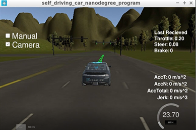
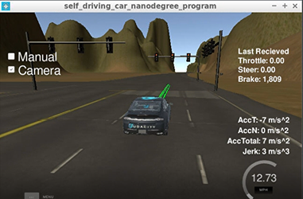
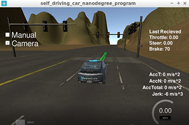

## 1. Goals
In this project my goal is to enable Carla to drive around the test track using waypoint navigation.
I implement components of the Perception, Planning and Control subsystems.  
The vehicle should run the test track according to the waypoints and stops at red traffic lights.


## 2. Steps
The steps of this project are the following. I followed the walkthrough lessons.
### (1)	Waypoint Updater Node (partial)
At first, I subscribe only “/base_waypoints” and “current_pose” and check the whether Waypoint Updater can publish “/final_waypoints”.
### (2)	DBW (Driver By Wire) Node
Implement the controller and check whether Carla can run according to the waypoints.
### (3)	Traffic Light Detection
(a)	Detect the traffic light and its color from “/image_color”.  
(b)	Convert traffic light position to a waypoint index and publish “/traffic_waypoint”.
### (4)	Waypoint Updater Node (full)
Use “traffic_waypoint” to change the waypoint target velocities, then publish “/final_waypoint” to stop Carla if the traffic light color is red.
### (5)	Change points
(a)	Number of waypoints to be published  
(b)	PID gains  
(c)	Deceleration profile  

## 3. Submission
### (1) GitHub
https://github.com/kkumazaki/Self-Driving-Car_Project9_Capstone

### (2) Directory
I cloned the basic repository from Udacity https://github.com/udacity/CarND-Capstone
and modified the following files.
####	Writeup_of_Lesson18.pdf: This file
####	/ros/src/waypoint_updater/
-	waypoint_updater.py: Updates the target velocity property of each waypoint based on traffic light.
-	waypoint_loader.py: Generates and publishes the static waypoint data.
####	/ros/src/twist_controller/
-	dbw_node.py: Publishes throttle, steering, brake commands to control the vehicle.
-	twist_controller.py: Generate target values using PID controller, low pass filter, etc.
-	pid.py: PID controller. (I only modified this module to add loggings)

## 4. Reflection
Please refer the [writeup](Writeup_of_Lesson18.pdf)

## 5. Result
The final code was able to achieve the Project Rubric as below.
-	The code is built successfully and connects to the simulator.
-	Waypoints are published to plan Carla’s route around the track.
-	Controller commands are published to operate Carla’s throttle, brake, and steering.
-	Successfully navigate the full track more than once.  

Carla started to run after the traffic light became from red to green.


When Carla reached the red light, it started to decelerate and stop in front of the intersection.




I think if I was able to set bigger LOOKAHEAD_WPS, Carla was able to stop earlier than this.

## Udacity Instruction
This is the project repo for the final project of the Udacity Self-Driving Car Nanodegree: Programming a Real Self-Driving Car. For more information about the project, see the project introduction [here](https://classroom.udacity.com/nanodegrees/nd013/parts/6047fe34-d93c-4f50-8336-b70ef10cb4b2/modules/e1a23b06-329a-4684-a717-ad476f0d8dff/lessons/462c933d-9f24-42d3-8bdc-a08a5fc866e4/concepts/5ab4b122-83e6-436d-850f-9f4d26627fd9).

Please use **one** of the two installation options, either native **or** docker installation.

### Native Installation

* Be sure that your workstation is running Ubuntu 16.04 Xenial Xerus or Ubuntu 14.04 Trusty Tahir. [Ubuntu downloads can be found here](https://www.ubuntu.com/download/desktop).
* If using a Virtual Machine to install Ubuntu, use the following configuration as minimum:
  * 2 CPU
  * 2 GB system memory
  * 25 GB of free hard drive space

  The Udacity provided virtual machine has ROS and Dataspeed DBW already installed, so you can skip the next two steps if you are using this.

* Follow these instructions to install ROS
  * [ROS Kinetic](http://wiki.ros.org/kinetic/Installation/Ubuntu) if you have Ubuntu 16.04.
  * [ROS Indigo](http://wiki.ros.org/indigo/Installation/Ubuntu) if you have Ubuntu 14.04.
* Download the [Udacity Simulator](https://github.com/udacity/CarND-Capstone/releases).

### Docker Installation
[Install Docker](https://docs.docker.com/engine/installation/)

Build the docker container
```bash
docker build . -t capstone
```

Run the docker file
```bash
docker run -p 4567:4567 -v $PWD:/capstone -v /tmp/log:/root/.ros/ --rm -it capstone
```

### Port Forwarding
To set up port forwarding, please refer to the "uWebSocketIO Starter Guide" found in the classroom (see Extended Kalman Filter Project lesson).

### Usage

1. Clone the project repository
```bash
git clone https://github.com/udacity/CarND-Capstone.git
```

2. Install python dependencies
```bash
cd CarND-Capstone
pip install -r requirements.txt
```
3. Make and run styx
```bash
cd ros
catkin_make
source devel/setup.sh
roslaunch launch/styx.launch
```
4. Run the simulator

### Real world testing
1. Download [training bag](https://s3-us-west-1.amazonaws.com/udacity-selfdrivingcar/traffic_light_bag_file.zip) that was recorded on the Udacity self-driving car.
2. Unzip the file
```bash
unzip traffic_light_bag_file.zip
```
3. Play the bag file
```bash
rosbag play -l traffic_light_bag_file/traffic_light_training.bag
```
4. Launch your project in site mode
```bash
cd CarND-Capstone/ros
roslaunch launch/site.launch
```
5. Confirm that traffic light detection works on real life images

### Other library/driver information
Outside of `requirements.txt`, here is information on other driver/library versions used in the simulator and Carla:

Specific to these libraries, the simulator grader and Carla use the following:

|        | Simulator | Carla  |
| :-----------: |:-------------:| :-----:|
| Nvidia driver | 384.130 | 384.130 |
| CUDA | 8.0.61 | 8.0.61 |
| cuDNN | 6.0.21 | 6.0.21 |
| TensorRT | N/A | N/A |
| OpenCV | 3.2.0-dev | 2.4.8 |
| OpenMP | N/A | N/A |

We are working on a fix to line up the OpenCV versions between the two.
